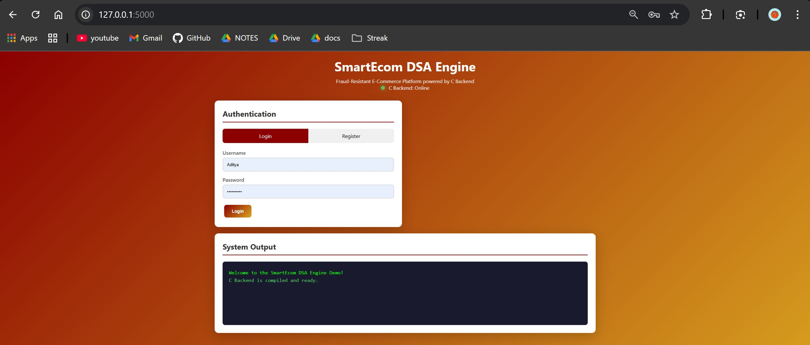
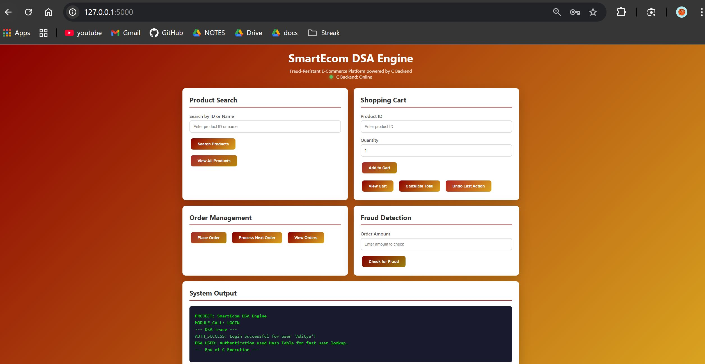

# SmartEcom - Fraud-Resistant E-Commerce Engine

A full-stack e-commerce demonstration application featuring a **Flask web frontend** and a **C backend** that implements various Data Structures and Algorithms (DSA) concepts.

## Screenshots

### Login Page


### Dashboard


## Project Overview

This project demonstrates the integration of a Python Flask web application with a compiled C backend. The C backend handles core business logic using efficient data structures, while Flask provides a modern web interface.

### Key Features

- **User Authentication** - Hash Table implementation for fast user lookup
- **Product Catalog** - Binary Search Tree (BST) for efficient product search
- **Shopping Cart** - Linked List with Stack-based undo functionality
- **Order Processing** - Queue (FIFO) for order management
- **Fraud Detection** - Hash Table for duplicate review detection

## Project Structure

```
Smart-Ecom-Fraud-Resistant-E-Commerce-Engine/
├── app.py                 # Flask application (Python)
├── run.bat                # One-click compile and run script
├── README.md              # Project documentation
├── .gitignore             # Git ignore rules
│
├── Demo_Images/           # Screenshots
│   ├── Demo1_LoginPage.JPG
│   └── Demo2_LoginPage.JPG
│
├── src/                   # C source files
│   ├── main.c             # Main entry point and request handler
│   ├── auth.c             # User authentication (Hash Table)
│   ├── product.c          # Product catalog (BST)
│   ├── cart.c             # Shopping cart (Linked List + Stack)
│   ├── fraud.c            # Fraud detection (Hash Table)
│   └── order.c            # Order processing (Queue)
│
├── include/               # C header files
│   ├── data.h             # Shared data structures
│   ├── auth.h             # Auth function declarations
│   ├── product.h          # Product function declarations
│   ├── cart.h             # Cart function declarations
│   ├── fraud.h            # Fraud function declarations
│   └── order.h            # Order function declarations
│
├── bin/                   # Compiled executables
│   └── smartecom.exe      # Compiled C backend
│
├── templates/             # Flask HTML templates
│   └── index.html         # Main web interface
│
└── static/                # Static web assets
    ├── css/               # Stylesheets
    └── js/                # JavaScript files
```

## Prerequisites

- **Python 3.x** - For running the Flask web server
- **Flask** - Python web framework (`pip install flask`)
- **GCC** - C compiler (MinGW on Windows)

## Quick Start

### Option 1: Using run.bat (Recommended for Windows)

Simply double-click `run.bat` to:
1. Check for required dependencies (GCC, Python)
2. Compile the C backend automatically
3. Install Flask if not present
4. Start the Flask development server

### Option 2: Manual Setup

1. **Compile the C backend:**
   ```bash
   gcc -I include src/main.c src/auth.c src/product.c src/cart.c src/fraud.c src/order.c -o bin/smartecom.exe
   ```

2. **Install Flask:**
   ```bash
   pip install flask
   ```

3. **Run the application:**
   ```bash
   python app.py
   ```

4. **Open in browser:**
   Navigate to `http://127.0.0.1:5000`

## Default Login Credentials

| Username   | Password    |
|------------|-------------|
| teamlead   | 1234        |
| vaishnavi  | 5678        |
| Aditya     | Aditya1234  |

## Data Structures Used

| Module          | Data Structure      | Purpose                              |
|-----------------|---------------------|--------------------------------------|
| Authentication  | Hash Table          | O(1) average user lookup             |
| Product Catalog | Binary Search Tree  | O(log n) product search by ID        |
| Shopping Cart   | Linked List         | Dynamic cart item management         |
| Cart Undo       | Stack (LIFO)        | Reverse last cart operation          |
| Order Queue     | Queue (FIFO)        | Process orders in sequence           |
| Fraud Detection | Hash Table          | Detect duplicate reviews             |

## API Endpoints

| Endpoint              | Method | Description                    |
|-----------------------|--------|--------------------------------|
| `/`                   | GET    | Load main page                 |
| `/`                   | POST   | Execute actions (search, cart) |
| `/auth`               | POST   | User login/registration        |
| `/execute_cart_undo`  | POST   | Undo last cart action          |

## How It Works

1. **Flask Frontend**: The Python Flask application serves the web interface and handles HTTP requests
2. **C Backend**: Core business logic runs in a compiled C executable
3. **Communication**: Flask invokes the C executable via subprocess, passing actions and parameters as command-line arguments
4. **Response**: The C backend prints results to stdout, which Flask captures and displays in the web interface

## License

This project is for educational and demonstration purposes.
